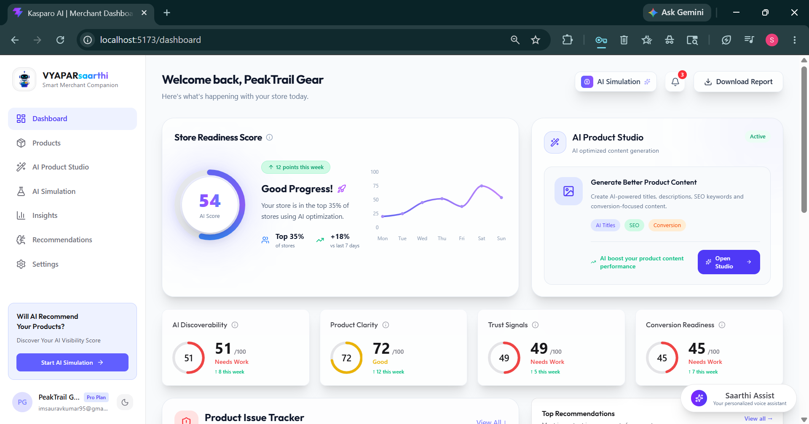
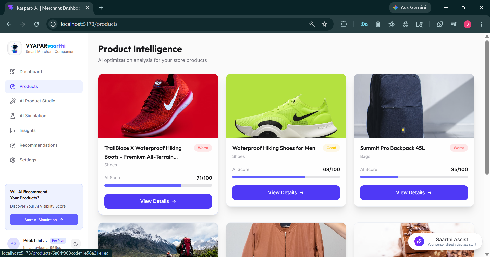
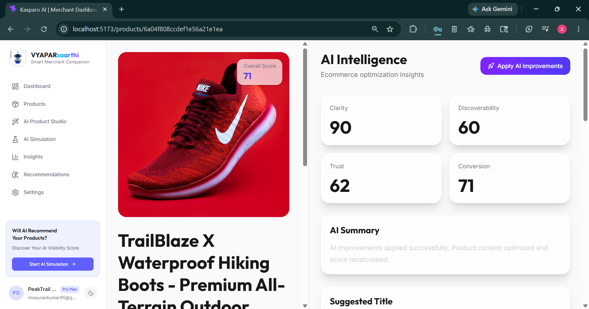
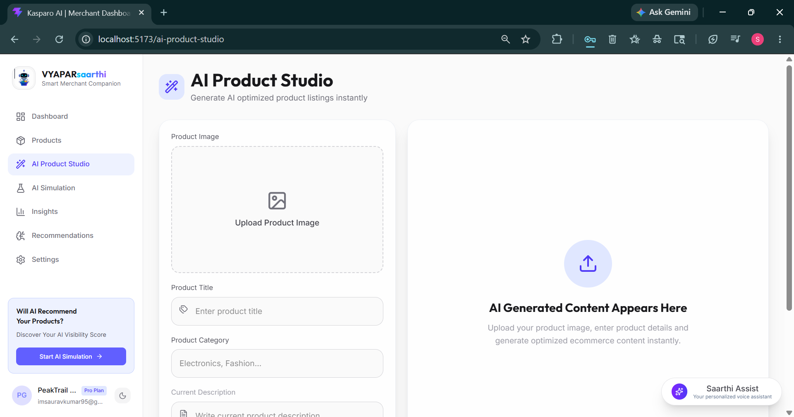
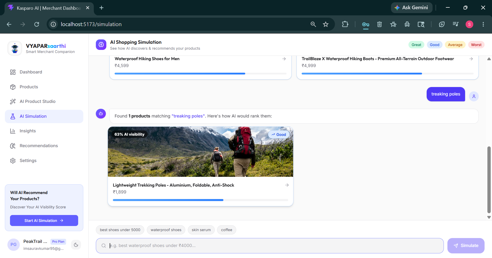
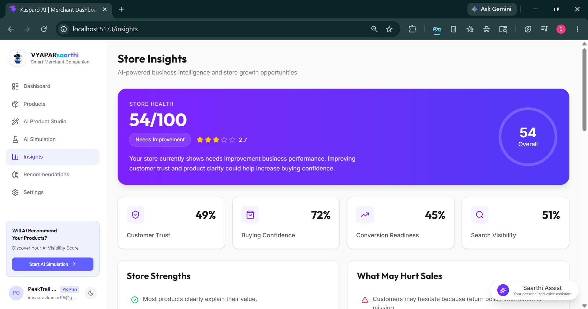
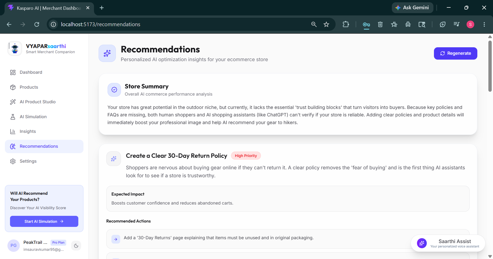
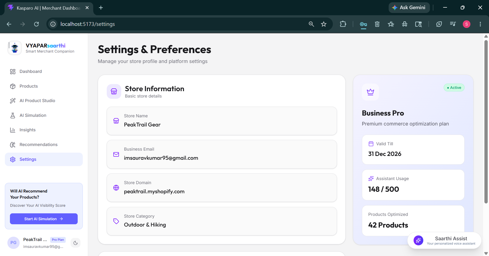

# 🛍️ VYAPARsaarthi
### AI-Powered Merchant Visibility & Product Optimization Platform

> **Hackathon:** Kasparro Agentic Commerce Hackathon  
> **Track:** Track 5 (Advanced) — AI Representation Optimizer  
> **Team Name:** PLAN B  
> **Members:** Saurav Kumar · Ankit Kumar Jha  

---

## 📌 Table of Contents

1. [Problem Statement](#-problem-statement)
2. [Product Overview](#-product-overview)
3. [User Journey](#-user-journey)
4. [Complete Feature Walkthrough](#-complete-feature-walkthrough)
   - [Dashboard](#1--dashboard)
   - [Products Table](#2--products-table)
   - [Product Detail Page](#3--product-detail-page)
   - [AI Product Studio](#4--ai-product-studio)
   - [AI Shopping Simulation](#5--ai-shopping-simulation)
   - [Insights](#6--insights)
   - [Recommendations](#7--recommendations)
   - [Saarthi Voice Assistant](#8--saarthi-voice-assistant)
   - [Settings](#9--settings)
5. [Business Model](#-business-model)
6. [Pricing Plans](#-pricing-plans)
7. [Track Alignment](#-track-alignment)
8. [Future Scope](#-future-scope)
9. [Team](#-team)

---

## 🔴 Problem Statement

Modern merchants upload products to Shopify but have **zero visibility** into how AI shopping agents perceive, rank, or recommend their products. When an AI agent like ChatGPT Shopping, Google Gemini, or Perplexity recommends products, it pulls from store data — product descriptions, images, policies, reviews, and structured metadata.

If that data is **incomplete, ambiguous, or contradictory**, the AI will either skip the merchant entirely or misrepresent them — meaning lost sales and zero visibility, with no way for the merchant to know why.

**VYAPARsaarthi** builds the diagnostic and optimization layer that makes this invisible problem visible and immediately actionable.

---

## 🚀 Product Overview

**VYAPARsaarthi** is an AI-powered merchant assistance platform for Shopify store owners. It functions as an **intelligence enhancement layer** on top of existing Shopify workflows — not replacing them, but supercharging them.

The platform automatically:
- Fetches and analyzes Shopify product data
- Evaluates each product across AI readiness parameters
- Generates a personalized analytics dashboard
- Provides ranked, actionable improvement suggestions
- Simulates how AI shopping agents currently perceive the store

---

## 👤 User Journey

VYAPARsaarthi works as an AI intelligence layer for merchants already operating on Shopify. Instead of replacing Shopify workflows, the platform enhances existing product data through AI-powered analysis and optimization.

### User Flow

**Merchant with products listed on Shopify**
↓
**Merchant logs into VYAPARsaarthi**
↓
**AI automatically fetches and analyzes all available product data**
↓
**System evaluates products across multiple parameters:**
- AI Readiness
- Discoverability
- Product Clarity
- Trust Signals
- Conversion Readiness

↓
**Personalized dashboard generated automatically**
↓
**Merchant reviews store analytics and individual product scores**
↓
**Merchant opens Product Details page to view deeper insights**
↓
**AI generates ranked improvement suggestions**
↓
**Merchant can apply AI improvements to optimize product content**
↓
**Product information updates and scores improve after re-analysis**
↓
**Merchant can run AI Shopping Simulation**

The AI Simulation allows merchants to understand how AI shopping agents perceive their products. Merchant enters a real customer query such as:

> "best waterproof hiking shoes under ₹5000"

The system simulates AI shopping behavior and shows:
- Products surfaced by AI
- AI visibility scores
- Product ranking positions
- Reasons behind ranking

This gives merchants visibility into how AI agents interpret and recommend products.

↓
**Merchant can explore AI Studio for future product guidance**

AI Studio provides:
- Optimized product titles
- Product descriptions
- FAQ suggestions
- Keyword recommendations
- Product positioning ideas

> AI Studio provides suggestions only and does not create products or directly save them to the database. Product management remains inside Shopify.

↓
**Merchant can explore Insights page for store-wide analysis**
↓
**Merchant can review Recommendations page for prioritized actions**
↓
**Merchant can interact with Saarthi Voice Assistant at any stage**

Example commands:
- *"Analyze products"*
- *"Which product needs improvement?"*
- *"Which product needs doing well?"*

The voice assistant provides a conversational and accessible way for merchants to  receive guidance.

---

> This creates a **continuous AI optimization cycle** where merchants analyze, improve, validate, and enhance product visibility — while keeping Shopify as the core commerce platform.

---

## ✨ Complete Feature Walkthrough

---

### 1. 📊 Dashboard

**URL:** `/dashboard`

The central command center for every merchant. The dashboard provides an instant health snapshot of the entire store's AI readiness at a glance.

#### What's on the Dashboard:

| Widget | Description |
|---|---|
| **Store Readiness Score** | A 0–100 AI optimization score with weekly trend chart. Shows change vs. last 7 days (e.g., +18%) and percentile ranking among all stores (e.g., "Top 35%") |
| **AI Discoverability** | Score (0–100) measuring how easily AI agents can find and surface your products. Tracks weekly change. |
| **Product Clarity** | Score for how clearly product information is written and structured for AI comprehension. |
| **Trust Signals** | Measures presence of return policies, FAQs, reviews, and trust-building content that AI agents check for. |
| **Conversion Readiness** | How optimized the product listings are for driving purchase decisions once discovered. |
| **Product Issue Tracker** | A quick-access widget showing products with critical AI readiness issues, sorted by urgency. |
| **Top Recommendations** | The highest-impact actions the merchant can take today, surfaced directly on the dashboard. |
| **AI Product Studio Card** | Quick-launch shortcut to the AI content generation studio. |
| **Product Table Card**| |5 Bottom Performers highlighted ,with AI scores and vew analysis button|
| **Download Report**| |Merchant can easily download their report of progress in doc format|

**Example State (PeakTrail Gear):**
- Store Readiness Score: **54/100** (+12 this week, Good Progress 🚀)
- AI Discoverability: **51/100** (Needs Work)
- Product Clarity: **72/100** (Good)
- Trust Signals: **49/100** (Needs Work)
- Conversion Readiness: **45/100** (Needs Work)

---

### 2. 📦 Products 

**URL:** `/products`

A full view of all products in the Shopify store with AI performance scoring for each.

#### Features:
- **Per-product AI Score** displayed with color-coded tags: `Great` / `Good` / `Average` / `Worst`
- **Score Breakdown Preview** — hover or tap any product to see a summary of Clarity, Discoverability, Trust, and Conversion sub-scores
- **Sort & Filter** — sort by score, category, or tag; filter by performance tier
- **View analysis Button** — jump directly to a product's AI improvement panel

---

### 3. 🔍 Product Detail Page — AI Intelligence Panel

**URL:** `/products/:id`

The deep-dive view for any individual product. This is where merchants understand exactly how an AI agent sees their product and what they need to fix.

#### Sub-scores Displayed:
- **Clarity Score** — Is the product description precise and unambiguous?
- **Discoverability Score** — Are the right keywords, categories, and tags present?
- **Trust Score** — Are reviews, materials, certifications, and specifications included?
- **Conversion Score** — Is there urgency, value framing, and purchase-trigger language?

#### AI Summary:
A paragraph generated by AI explaining the product's current AI perception in plain language — what an AI agent would say about this product if a user asked about it.

#### Suggested Improvements:
A ranked list of specific fixes. Example:
1. Add material composition (boosts Trust by ~12 pts)
2. Include waterproof rating specification (boosts Discoverability by ~9 pts)
3. Add size chart link (boosts Conversion by ~8 pts)

#### One-Click "Apply AI Improvements"

Merchants can apply AI-generated recommendations with a single click to automatically enhance existing product content and improve overall AI readiness scores.
The system updates product information using AI suggestions such as:
- Improving product descriptions  
- Enhancing clarity and discoverability  
- Adding missing information  
- Strengthening trust signals  
- Optimizing content structure  
Once applied, the product is re-analyzed and updated scores reflect the improvements made.
This allows merchants to quickly optimize products without manually editing every detail.

---

### 4. 🏪 AI Product Studio

**URL:** `/ai-studio`

A strategic content generation environment for merchants launching new products or optimizing existing ones.

#### How It Works:
1. **Upload a product image** — AI performs visual analysis to identify product type, features, and attributes
2. **Enter product title, category, and current description** (or start from scratch)
3. **AI generates optimized content package:**
   - Optimized product title (SEO + AI-friendly)
   - Full product description with AI-readable structure
   - SEO keyword list (primary + secondary + long-tail)
   - Conversion-focused bullet points
   - Suggested tags and collections
   - FAQ section for the product

#### Use Cases:
- **New product launch** — The generated content acts as AI guidance ,only and helps merchants to plan or refine future products content.

> AI Studio provides guidance and content. Publishing to Shopify happens through the Shopify dashboard — VYAPARsaarthi improves the intelligence layer, not the commerce layer.

---

### 5. 🔬 AI Shopping Simulation

**URL:** `/ai-simulation`

The most unique and powerful feature — a live simulation of how an AI shopping agent experiences the merchant's store when a real user asks it for product recommendations.

#### How It Works:
1. Merchant types a query a real buyer might use — e.g., *"best waterproof hiking boots under ₹5000"*
2. The AI simulates a shopping agent's discovery and ranking process across the store's catalog
3. Results show:
   - Which products would be **surfaced** (and which would be ignored)
   - **AI Visibility %** for each surfaced product
   - Performance tags: `Great` / `Good` / `Average` / `Worst`
   - Side-by-side comparison of all matching products with visibility scores
   - Explanation of *why* each product ranked where it did

#### Why This Matters:
This gives merchants **ground truth** on AI perception — not guesswork. They can test multiple queries, see exactly which products are invisible to AI agents, and understand the specific content gaps causing it.

---

### 6. 💡 Insights

**URL:** `/insights`

Store-level intelligence that goes beyond individual products. The Insights page analyzes the entire store's health and surfaces systemic issues.

#### Metrics:
- **Store Health Score** — 54/100 overall (with star rating, e.g., 2.7/5)
- **Customer Trust %** — 49%
- **Buying Confidence %** — 72%
- **Conversion Readiness %** — 45%
- **Search Visibility %** — 51%

#### Insights Sections:
- **Store Strengths** — what the store is doing well (e.g., "Most products clearly explain their value")
- **What May Hurt Sales** — systemic risks (e.g., "Customers may hesitate because return policy information is missing")
- **FAQ Coverage Gaps** — topics buyers commonly ask that the store doesn't answer
- **Policy Clarity** — quality assessment of shipping, returns, and warranty policies
- **Content Gaps** — missing structured data, sparse descriptions, incomplete specifications

---

### 7. 🎯 Recommendations

**URL:** `/recommendations`

A prioritized, ranked action plan — not just a list of problems, but a step-by-step improvement roadmap ordered by business impact.

#### Structure:
- **Store Summary** — AI-generated paragraph assessing overall AI commerce readiness
- **Ranked Action Cards** — each card contains:
  - Recommendation title (e.g., "Create a Clear 30-Day Return Policy")
  - Priority badge: `High Priority` / `Medium Priority` / `Low Priority`
  - Plain-language explanation of *why* this matters to AI agents and buyers
  - **Expected Impact** — what score/metric improves and by how much
  - **Recommended Actions** — specific, step-by-step tasks (e.g., "Add a '30-Day Returns' page explaining that items must be unused and in original packaging")
- **Regenerate Button** — refresh all recommendations based on latest store data

#### Example Recommendations (PeakTrail Gear):
1. 🔴 **High Priority** — Create a Clear 30-Day Return Policy *(boosts customer confidence, reduces abandoned carts)*
2. 🟡 **Medium Priority** — Add product-level FAQ sections
3. 🟢 **Low Priority** — Include customer review highlights in product descriptions

---

### 8. 🎙️ Saarthi Voice Assistant

**Available across all platform pages except AI Simulation and Product Detail pages** *(bottom-right floating assistant).*

Saarthi Voice Assistant remains accessible throughout most sections of the platform to provide navigation support and conversational guidance. It is intentionally hidden on AI Simulation and Product Detail pages to reduce distractions and maintain a focused user experience during detailed analysis workflows.

A personalized, **bilingual voice assistant** (English + Hinglish) that lets merchants navigate and get answers conversationally instead of clicking through menus.

#### Example Commands:

| Command | Action |
|---|---|
| *"What is my store score?"* | Reads out the store readiness score |
| *"Which products are doing well?"* | Lists top performing products |
| *"How can I improve my TrailBlaze X score?"* | Specific recommendations for that product |
| *"Open recommendations"* | Shows the recommendations panel |
| *"Analyze my products"* | Triggers full AI re-analysis |
| *"Kaun sa product sabse zyada score kar raha hai?"* | Works in Hinglish too |

Saarthi is designed specifically for Indian merchants who naturally switch between English and Hindi — making the platform accessible without requiring technical literacy.

---

### 9. ⚙️ Settings & Preferences

**URL:** `/settings`

Store profile management and platform configuration.

#### Store Information:
- Store Name, Business Email, Store Domain, Store Category

#### Business Plan Panel:
- Current plan name and status
- Plan validity date
- Assistant usage meter (e.g., 148/500 queries used)
- Products optimized count (e.g., 42 Products)

---

## 💼 Business Model

VYAPARsaarthi is a **SaaS (Software-as-a-Service)** platform targeting Shopify merchants across India and Southeast Asia. The business model is built on three revenue pillars:

### 1. Subscription Plans (Primary Revenue)
Recurring monthly/annual subscriptions with tiered feature access.

### 2. Usage-Based Add-Ons (Secondary Revenue)
Pay-per-use credits for AI content generation, bulk product optimization, and AI simulations beyond plan limits.

### 3. Agency & Reseller Partnerships (Expansion Revenue)
White-label licensing for Shopify agencies to offer VYAPARsaarthi to their merchant clients.

### Why Merchants Pay:
- **Direct ROI** — higher AI visibility → more organic AI-driven traffic → more sales
- **Time savings** — hours of manual copywriting replaced by one-click AI optimization
- **Competitive advantage** — merchants who optimize for AI agents gain an edge over those who don't
- **Risk reduction** — avoid being skipped or misrepresented by AI shopping tools

---

## 💳 Pricing Plans

### 🆓 Starter (Free)
*Perfect for merchants exploring AI-powered optimization*

| Feature | Limit |
|---|---|
| Store Readiness Score | ✅ Basic |
| Products analyzed | Up to 10 |
| AI Improvements | 5/month |
| AI Simulation queries | 3/month |
| Saarthi Voice Assistant | ❌ |
| AI Product Studio | ❌ |
| Recommendations | Basic (top 3) |
| Support | Community |

**Price: ₹0/month**

---

### 🚀 Growth (Most Popular)
*For merchants growing their online business*

| Feature | Limit |
|---|---|
| Store Readiness Score | ✅ Full + Trends |
| Products analyzed | Up to 75 |
| AI Improvements | 25/month |
| AI Simulation queries | 15/month |
| Saarthi Voice Assistant | ✅ English |
| AI Product Studio | ✅ 10 generations/month |
| Recommendations | Full ranked list |
| Downloadable Reports | ✅  doc|
| Support | Email Support |

**Price: ₹299/month** *(₹249/month billed annually)*

---

### 👑 Business Pro
*For established stores and active sellers*

| Feature | Limit |
|---|---|
| Store Readiness Score | ✅ Full + Reports |
| Products analyzed | Up to 300 |
| AI Improvements | 100/month |
| AI Simulation queries | 50/month |
| Saarthi Voice Assistant | ✅ English + Hinglish |
| AI Product Studio | ✅ Unlimited |
| Recommendations | Full + Priority Insights |
| Downloadable Reports | ✅ PDF + doc|
| Support | Priority Support |

**Price: ₹699/month** *(₹599/month billed annually)*

---

### 🏢 Enterprise
*For agencies and multi-store operators*

| Feature | Details |
|---|---|
| Products analyzed | Unlimited |
| AI Improvements | Unlimited |
| AI Simulation | Unlimited |
| White-label options | ✅ |
| API access | ✅ |
| Custom integrations | ✅ |
| Dedicated support | ✅ |

**Price: Custom**

---

### 📊 Revenue Projection (Year 1 Estimate)

| Segment | Merchants | Avg Revenue | Annual Revenue |
|---|---:|---:|---:|
| Growth Plan | 300 | ₹299/mo | ₹10.7L |
| Business Pro | 100 | ₹699/mo | ₹8.3L |
| Enterprise | 5 | ₹8,000/mo | ₹4.8L |
| **Total** | **405** | — | **~₹23–24L/year** |

---

## 🎯 Track Alignment — Track 5: AI Representation Optimizer

| Track Requirement | VYAPARsaarthi Delivers |
|---|---|
| Identifies AI readiness gaps | Store Readiness Score + per-product gap analysis |
| Missing FAQ coverage | Insights page flags unanswered buyer questions |
| Ambiguous policies | Policy clarity scoring in Trust Signals |
| Weak trust signals | Trust metric with specific actionable suggestions |
| Prioritizes improvements | Ranked recommendation engine by impact |
| Shows AI perception vs. merchant intent | AI Shopping Simulation — real query-based testing |
| Helps take concrete action | One-click "Apply AI Improvements" on product pages |
| Genuine product thinking | Conversion readiness, not just keyword stuffing |

---

## 🔭 Future Scope

The current build demonstrates the core concept. Planned improvements for future iterations:

- **Shopify Live Integration** — direct OAuth connection to live merchant stores instead of synthetic data
- **Real AI Shopping Agent APIs** — integration with actual agent APIs (Perplexity, Google Shopping Graph, ChatGPT plugins) for authentic simulation
- **Image Optimization Engine** — AI analysis and enhancement of product images for better AI agent comprehension
- **Advanced Analytics** — cohort tracking, score history over time, competitive benchmarking
- **Multilingual Expansion** — support for Tamil, Telugu, Bengali, Marathi, and other Indian languages beyond Hinglish
- **Predictive AI Recommendations** — proactive suggestions before scores drop, based on catalog and market trends

---

## 👥 Team

| Name | Role |
|---|---|
| **Saurav Kumar** | Full Stack + AI Integration |
| **Ankit Kumar Jha** | Product Design + Frontend |

**Team Name:** PLAN B  
**Hackathon:** Kasparro Agentic Commerce Hackathon  

---

**VYAPARsaarthi** — *Helping merchants improve AI visibility and product discoverability.*

Built for the Kasparro Agentic Commerce Hackathon

